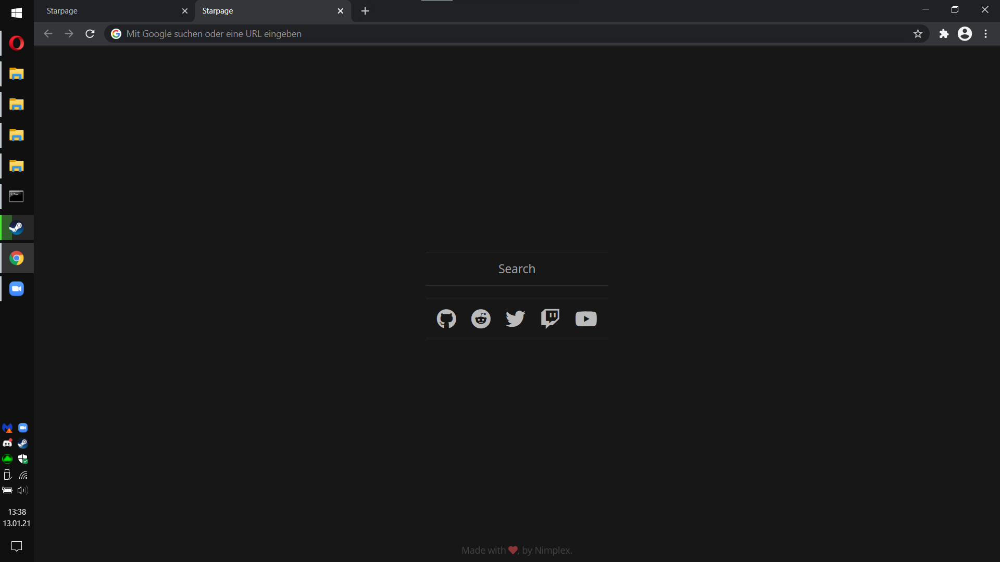
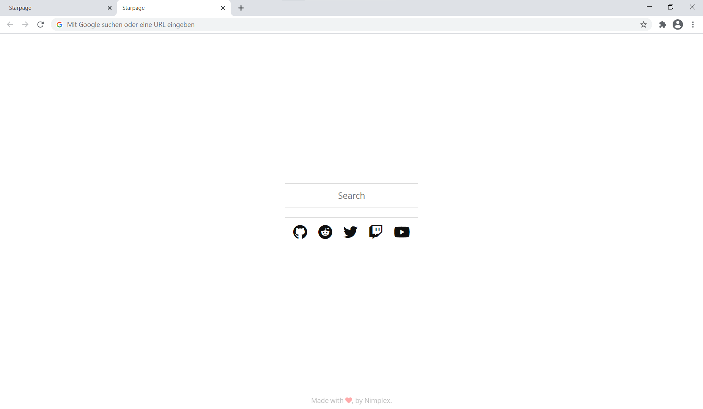

<h1 align="center">Minimal-StartPage</h1>
<h2 align="center"></h2>

 Minimalistic start page for chrome.  
 Uses your system theme to choose between light- and darkmode. 

---

<h2 align="center"><a href="/Installation.md"> Installation </a> | <a href="https://nimplex.github.io/Minimal-StartPage/"> Website </a> | <a href="https://nimplex.xyz/contact"> Contact </a></h2>

---

<table>	
	<tr>
		<td align="center">	
					
				 	
					
					<b>Darkmode</b>	
					
			   
		</td>	
		<td align="center">	
					
				 	
					
					<b>Lightmode</b>	
					
			   	
		</td>	
</table>
